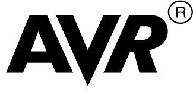
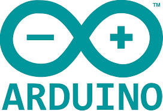
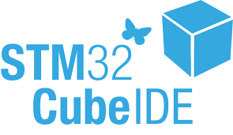
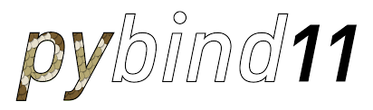

<h1  align="center">Hi there!</h1>

Welcome to my GitHub page! 

I am Christos, an Embedded Engineer from Greece, currently living in Heraklion.

<h3 align="center">These are some of the technologies I have used in the past:</h3>

  

  <!-- -------------------------------------------------------------------------------------------------------------- -->
  <h4 class="classp-grou">Programming:</h4>
   
  
   
  
   
   
   
  

  <!-- -------------------------------------------------------------------------------------------------------------- -->
  <h4 class="class-group">Linux:</h4>
   
   
   
   
   
   
   
  

  <!-- -------------------------------------------------------------------------------------------------------------- -->
  <h4 class="class-group">Embedded:</h4>
   
   
   
   
   
   
  

  <!-- -------------------------------------------------------------------------------------------------------------- -->
  <h4 class="class-group">IDEs/CADs:</h4>
  
   
   
   
    
   
   
   
  

  <!-- -------------------------------------------------------------------------------------------------------------- -->
  <h4 class="class-group">Frameworks/Libraries:</h4>
   
   
   
   
  
  

  <!-- -------------------------------------------------------------------------------------------------------------- -->
  <h4 class="class-group">Web:</h4>
   
   
   
   
  

  <!-- -------------------------------------------------------------------------------------------------------------- -->
  <h4 class="class-group">PC:</h4>
   
   
   
   
  

   

  <!-- -------------------------------------------------------------------------------------------------------------- -->

<h2 align="center">P.S: I invite you to be my guest! Look around my public repos and do not hesitate to contact me if you find interesting one of them ;)
</h2>

<h2 align="center">How to reach me:</h2>

   
   
   
   
   

