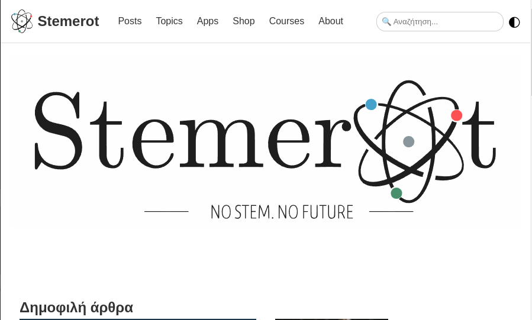
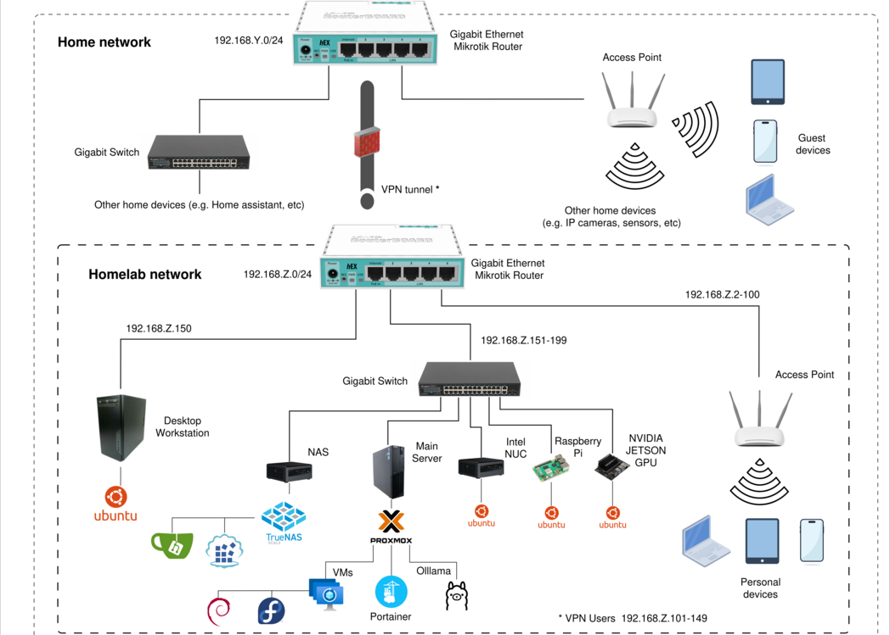
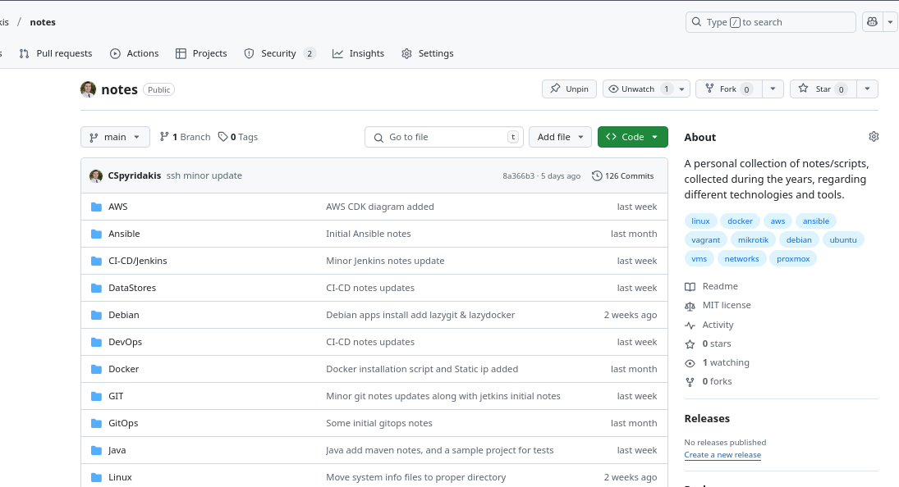
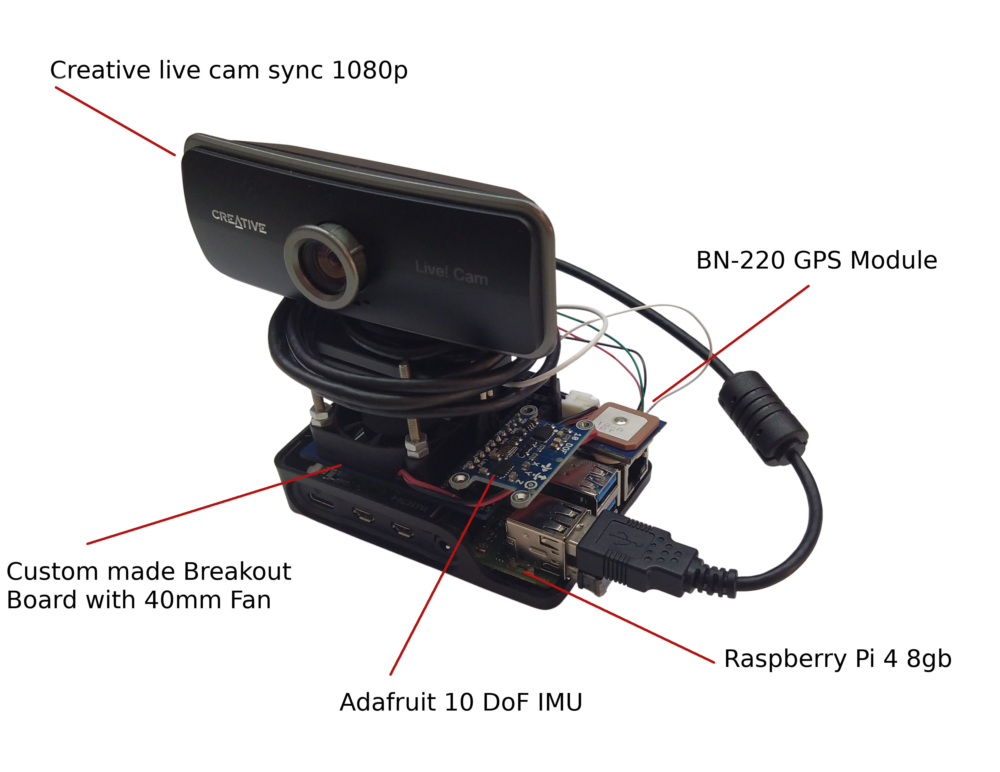
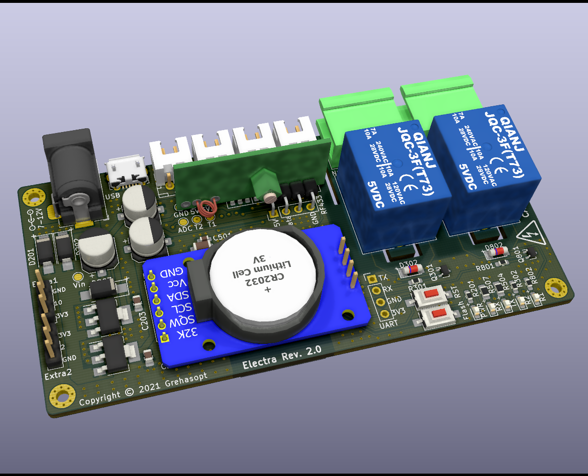
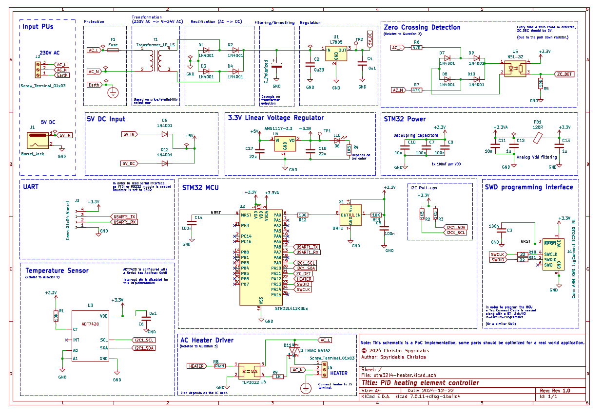

## Welcome to my GitHub page! 

### Digital Craftsman (Engineer | Creator | Author)

Hi, I’m Christos, an Engineer from Greece, driven by a deep passion for STEM. My journey began in embedded system development, where I built low-level systems and gained hands-on experience with hardware-software integration. Over time, I expanded my expertise in systems engineering, Linux, and networks, constantly seeking ways to improve efficiency and scalability. Recognizing the power of automation, I am currently expanding my system‐level thinking to DevOps principles like infrastructures and cloud‐native technologies to provide in a large scale cutting edge solutions.

   
   
   
   
   

## Feature Projects

<table>
  <tr>
    <!-- Stemerot -->
    <td align="center" valign="top">
      <strong>Creator of Stemerot.com</strong> 
       
      <em>Hugo, Bash, CI/CD, Cloudflare, Docker, AWS</em>
    </td>
    <!-- Homelab -->
    <td align="center" valign="top">
      <strong>Homelab</strong> 
       
      <em>System Administration, Networks, Proxmox, Docker, Virtualization, Mikrotik</em>
    </td>
    <!-- Personal collection of notes -->
    <td align="center" valign="top">
      <strong>Personal collection of notes</strong> 
       
      <em>AWS, RPM, Jenkins, Linux, Rust</em>
    </td>
  </tr>
  <tr>
    <!-- Mocap System -->
    <td align="center" valign="top">
      <strong>Mocap System</strong> 
       
      <em>C++, Matlab, ROS, Raspberry Pi, Bash</em>
    </td>
    <!-- Electra -->
    <td align="center" valign="top">
      <strong>Electra</strong> 
       
      <em>ESP8266, Kicad, ESP-IDF, C, Relays</em>
    </td> 
    <!-- STM32 Heater -->
    <td align="center" valign="top">
      <strong>STM32 Heater</strong> 
       
      <em>STM32, STM32CubeIDE, Kicad, C, Zero crossing detection, PID Controller</em>
    </td>
  </tr>
</table>

<h3 align="">These are some of the technologies I have used in the past:</h3>

<!-- BADGES:START -->
<!-- Auto-generated by scripts/gen-badges.sh — edit data there, then run the script. -->

<h4></h4>

<!-- BADGES:END -->

---

## Some profile statistics

 

---

<em>Names referenced are trademarks of their respective owners; used descriptively, no endorsement implied.</em>
